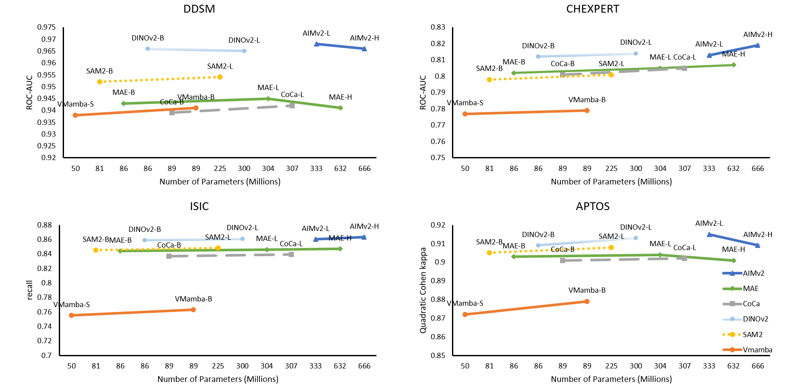

# Advancements in Medical Image Classification through Fine-Tuning Natural Domain Foundation Models 

<p align="center">
     <br />
</p>

### Abstract
Using massive datasets, foundation models are large-scale, pre-trained models that perform a wide range of tasks. These models have shown consistently improved results with the introduction of new methods. It is crucial to analyze how these trends impact the medical field and determine if these advancements can influence the medical domain. This study investigates the application of recent state-of-the-art foundation models—DINOv2, MAE, VMamba, CoCa, SAM 2, and AIMv2—for medical image classification. We explore their effectiveness on datasets including CBIS-DDSM for mammography, ISIC2019 for skin lesions, APTOS2019 for diabetic retinopathy, and CHEXPERT for chest radiographs. By fine-tuning these models and evaluating their configurations, we aim to understand the potential of these advancements in medical image classification. The results indicate that these advanced models significantly enhance classification outcomes, demonstrating robust performance despite limited labeled data. Based on our results, AIMv2, the DINOv2 and SAM2 models outperformed others, demonstrating that progress in natural domain training has positively impacted the medical domain and improved classification outcomes. 
## Train
### 1. Download Datasets
In this paper, we evaluate four different datasets. You can download the required datasets using the following links: [APTOS2019](https://www.kaggle.com/datasets/mariaherrerot/aptos2019), [DDSM](https://github.com/kazzastic/BreastCancer-Deep-Learning?tab=readme-ov-file), [CheXpert](https://www.kaggle.com/datasets/ashery/chexpert?select=train.csv) and [ISIC2019](https://www.kaggle.com/datasets/nasifsafwan/isic2019).
### 2. Parameters
To fine-tune foundation models, it's necessary to use a params.json file. The main parameters that need to be specified are the following:
| Parameter | Description                |
| :-------- | :------------------------- |
|dataset_params|To access each dataset, the available options are: APTOS2019, DDSM, CheXpert, or ISIC2019.|
| model_params |   For linear heads, the model is used as "none", or it can be used as "deit_base" for multi-head attention.|
|Foundation parameters|Foundation models used include SAM2 (sam2_b, sam2_l), MAE (vit_base_patch16, vit_large_patch16, vit_huge_patch14), AIMv2 (aimv2-large-patch14-224, aimv2-huge-patch14-224), Coca (coca_ViT-B-32, coca_ViT-L-14), DINOv2 (dinov2_vitb14, dinov2_vitl14), and CLIP (clip_vitb16). There is an option to unfreeze or freeze the last layers of the model.|
|training_params|Training specifications e.g. number of epochs, log frequency,...|

### 3. Fine-tune Foundation Models
Running classification.py with the specified parameters in the config file will reproduce all the results.

```bash
python classification.py --params_path "./params.json"
